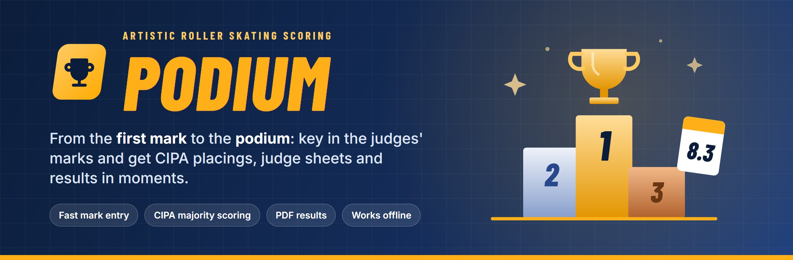
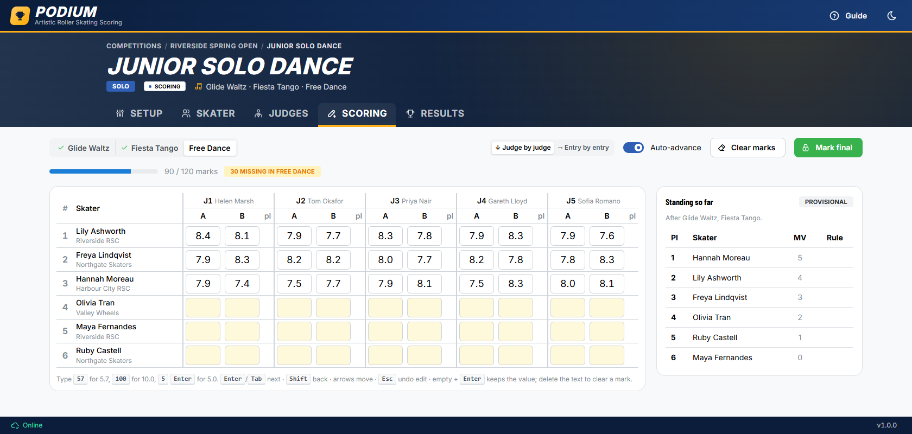
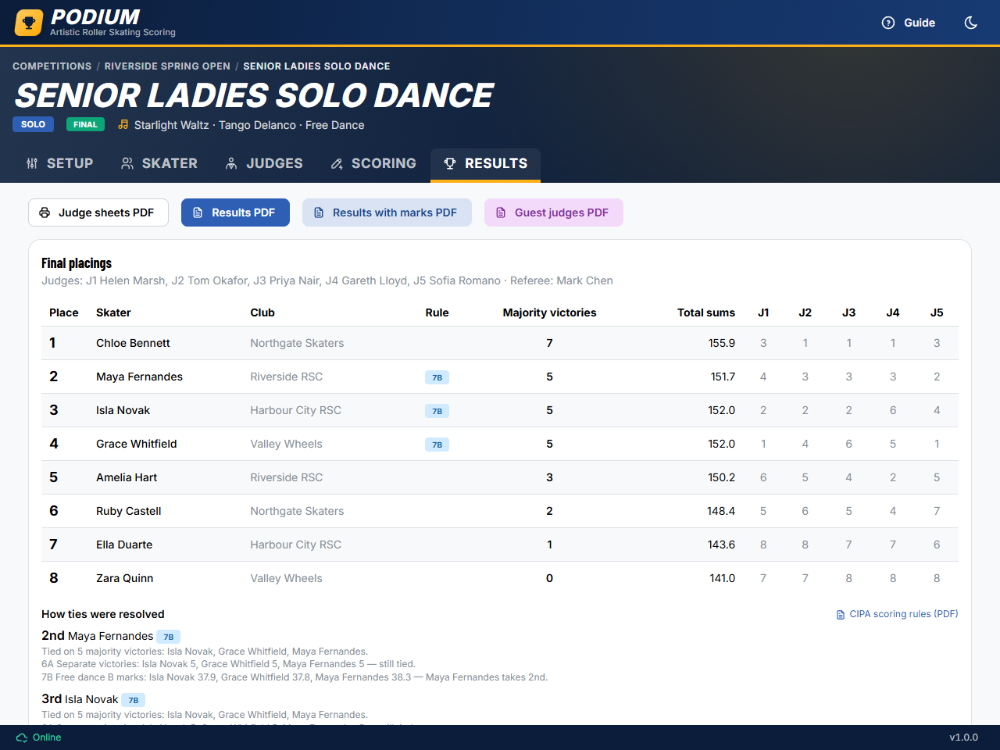
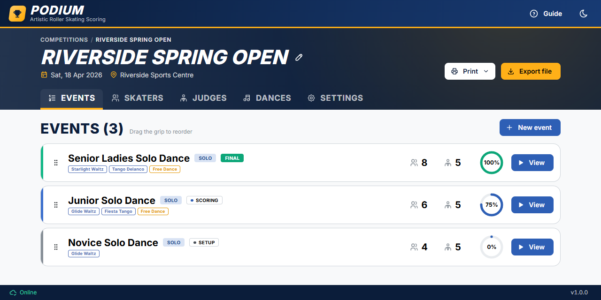
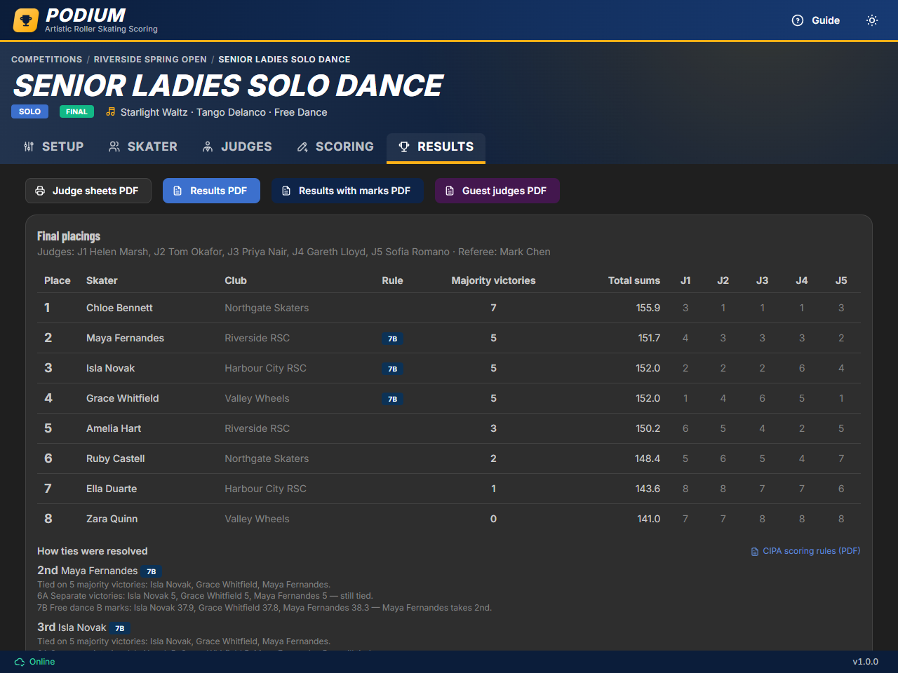

# Podium

<p align="center">
  
</p>

<p align="center">
  <a href="https://chrisshortall28.github.io/calculating/"><strong>🚀 Open Podium</strong></a> ·
  <a href="#deployment-and-installing">📲 Install it</a> ·
  <a href="#scoring-rules-cipa-system-of-scoring">🏆 Scoring rules</a> ·
  <a href="#development">🛠️ Develop</a>
</p>

**Podium is the Calculator's companion for artistic roller skating competitions.** Set up the
events, skaters, dances and judges, then key in the judges' marks as the skaters come off the
floor. Podium works out the placings by the **CIPA system of scoring** and has the judge sheets
and results PDFs ready to print.

## ✨ Highlights

- ⚡ **Fast mark entry.** A keyboard-driven grid built for speed: type `57` for 5.7 or `100`
  for 10.0, and the cursor moves on by itself. Enter marks judge by judge or entry by entry.
- 🏆 **CIPA majority scoring.** The table of victories, majority victories and every tie-break
  rule (6A/6B, 7B, 7C, 7A, 8) are applied automatically.
- 🔍 **Every tie explained.** The Results tab shows which rule decided each tied place and the
  numbers behind it, with a link to the CIPA manual.
- 📊 **Standings while you score.** A live provisional standing updates as each dance is
  completed.
- 🖨️ **PDFs in one click.** Judge sheets; standard, with-marks and guest-judges results; and a
  programme for spectators with a club-coloured cover and each event's skating order.
- 📴 **Works offline.** Podium is an installable app that runs entirely in the browser, with no
  server and no sign-in. Your data stays on your device.
- 💾 **Backup and transfer.** Export a competition to a `.pod` file and import it on another
  device (older `.json` backups still import).
- 🌙 **Light and dark themes**, and competitions can take their club colours.

## 📸 Screenshots

<table>
  <tr>
    <td width="50%"><br><sub><b>Scoring:</b> key in marks, with the standing so far alongside.</sub></td>
    <td width="50%"><br><sub><b>Results:</b> placings, with each tie-break rule explained.</sub></td>
  </tr>
  <tr>
    <td width="50%"><br><sub><b>Events:</b> every event's progress at a glance.</sub></td>
    <td width="50%"><br><sub><b>Dark theme:</b> easy on the eyes at the calculator's table.</sub></td>
  </tr>
</table>

<sub>The screenshots use a made-up competition, and every name in them is fictional.</sub>

## Development

```bash
npm install
npm run dev        # http://localhost:5173
npm test           # scoring engine, mark parser, grid navigation, import/export
npm run typecheck
npm run build      # production build + service worker in dist/
npm run build:pages && npm run preview:pages   # the GitHub Pages build, at http://localhost:4173/calculating/
npm run generate-icons                         # regenerate PNG icons after changing public/favicon.svg
```

## Deployment and installing

Every push to `main` type-checks, runs the tests and, only if they pass, deploys to GitHub Pages
(`.github/workflows/deploy.yml`): **https://chrisshortall28.github.io/calculating/**
Pushes to other branches and pull requests are type-checked and tested without deploying
(`.github/workflows/test.yml`).

One-time setup: repo **Settings → Pages → Build and deployment → Source: GitHub Actions**.

To install on the competition laptop, open the URL while online in Chrome or Edge and use
**Install Podium** (the install icon in the address bar). The app then works fully offline.
When a new version is deployed, the app shows "Update available" the next time it starts
online; nothing changes unless the Calculator clicks Reload.

To release a new version, bump `version` in `package.json` (shown in the status bar) and add an
entry to `src/app/changelog.ts` (shown in the "What's New?" popup when the version is clicked).

## Layout

| Path | What |
| --- | --- |
| `src/scoring/` | **Pure scoring engine**, with no React or DB code. `calculateEvent()` turns marks into placings and explanations. |
| `src/marks/` | Mark parsing (`57` → 5.7) and the keyboard-driven mark-entry grid. |
| `src/domain/` | Types, segments (compulsory dances or figures, and the A/B-marked free dance and programmes), the figures catalogue, entry display helpers. |
| `src/db/` | Dexie schema and repository functions, which cascade deletes of marks. |
| `src/io/` | Competition file export/import (versioned, validated with zod). |
| `src/pdf/` | Judge sheets, results and programme PDFs (pdfmake, lazy-loaded). |
| `src/features/` | Screens: home, competitions, events, rosters, scoring, results. |
| `public/` | Icons, and the CIPA scoring manual (`2009 - The CIPA System of Scoring.pdf`) linked from the results. |

## Scoring rules (CIPA system of scoring)

Implemented in `src/scoring/index.ts` from the 2009 CIPA scoring manual (pages 4–13 are the rules;
the worked examples C-1 to D-4 are on pages 24–31). Rule numbers are the manual's.

Events are **Dance** (compulsory dances and a free dance) or **Figures & Free** (up to four
compulsory figures, and a short and/or long programme). Compulsory dances and figures get one mark
per judge; the free dance and each programme an A and a B (artistic impression) mark.

1. **Sums**: each judge's sum for an entry is the total of all their marks in the event (A+B for
   the free dance and programmes). Dance marks are not factored. In a Figures & Free event each
   part's marks are multiplied by the event's factor for it (to two decimal places, editable in
   Setup). The defaults: short and long programmes 1 : 3; figures with both programmes one per
   figure, 1, 3 (two figures: 2 : 1 : 3); any other mix, all 1.
2. **Table of victories** (rules 2–3): every pair of entries is compared judge by judge; the
   higher sum wins that judge's victory. Equal sums go to the higher B mark — the free dance's;
   in singles and pairs free skating, the long then the short programme's; with figures, none —
   and are still equal, half a victory each.
3. **Majority victories** (rule 4): an entry has a majority victory over another when more than
   half the judges' victories are its own (exactly half: half a majority victory each).
4. **Placing** (rule 5): most majority victories takes the highest open place.
5. **Ties on majority victories**, in order:
   - **6A / 6B** separate victories — judges' victories between the tied entries only
     (6A three or more tied, 6B two tied)
   - **7B** total of all judges' B marks: the free dance's (dance events with a free dance); the
     long, then the short programme's (Figures & Free events without figures, one 7B step each).
     Events with figures skip 7B.
   - **7C** total victories against every entry
   - **7A** total sums (factored)
   - **8** still equal: the entries share the place, and the places below are used up.

   A rule that separates the tied entries places them all in its order; entries still level on
   it go on to the next rule. Only once every tied entry is placed does rule 5 resume.

### Where the working is shown

- **Results tab**: a Rule column on tied places (e.g. `7A`; hover for the rule), "How ties were
  resolved" with the values compared at each rule and a link to the manual, the judges' equal
  sums (rule 3), and the summary of scores and table of victories.
- **Results PDFs**: a short Rule column with a key to the rules used; "Results with marks" adds
  the tie explanations and the table of victories. The guest judges PDF shows placings only (tied
  places marked `=`), with no rules.
- **Scoring tab**: the event result once every mark is in, and before that the standing from the
  dances or figures completed so far (CIPA has no per-dance places).

Rule 6B is shown as "6B (S.M.V.)" (separate majority victories); labels come from `ruleLabel()`
in `src/scoring/rules.ts`.

The manual (`public/2009 - The CIPA System of Scoring.pdf`) is linked from "How ties were
resolved", opening at page 4, and is precached so it opens offline. If it is renamed, update
`CIPA_MANUAL_URL` in `src/features/results/PlacementRule.tsx`.

### Not modelled

No such events in Podium, so not implemented: original dance (rules 3 and 7B's O.D. steps).
Worked examples live in `src/scoring/scoring.test.ts`.

### Compulsory figures

The 41 figures are built in (`src/domain/figures.ts`), shown as e.g. "39. Paragraph Loops BOI -
BIO" — the edges without the starting foot. Each figure in an event is on the left, the right,
or unspecified. A figure's number is stored in its marks' keys, so numbers must never be reused.

## Licence

Podium is free to use, copy, modify and share for any purpose, under the [BSD Zero Clause
License](LICENSE). The open-source packages it is built on keep their own (permissive) licences;
see [THIRD_PARTY_NOTICES.md](THIRD_PARTY_NOTICES.md).

The CIPA scoring manual in `public/` is CIPA's document and is not covered by Podium's licence.
